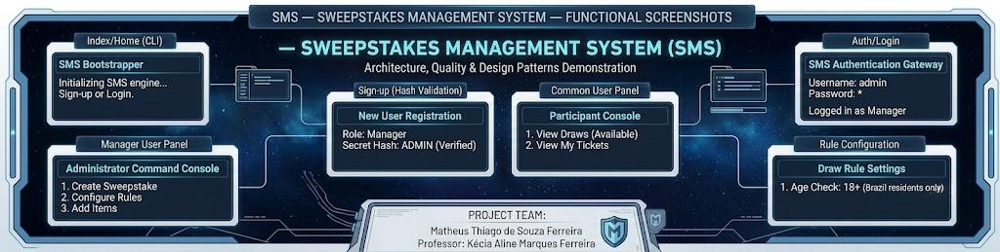
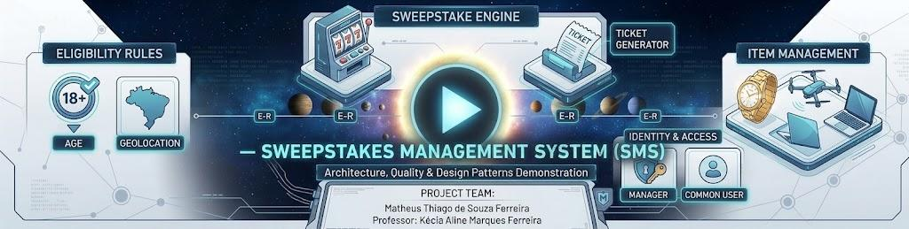

# SMS — Sweepstakes Management System 🎟️🛡️

A CLI-driven architectural software system engineered to manage dynamic sweepstake lifecycles, entry validation, and partitioned user permission hierarchies. This project was developed as a practical environment to implement GoF (Gang of Four) software patterns and architectural paradigms for the **Software Quality** course in the Computer Engineering curriculum at CEFET-MG.

---

## 👥 Authorship & Faculty

* **Professor:** Kécia Aline Marques Ferreira
* **Student:** Matheus Thiago de Souza Ferreira

---

## 🛠️ Software Architecture & Component Modeling

The project leverages decoupled domain component boundaries. Each structural folder implements isolated domain models paired with explicit controller logic, reflecting strict encapsulation and design pattern principles.

### Technical System Documentation
* 📑 **[Software Requirements Specification (pt-BR)](./Docs/SoftwareSpecification.pdf)**
* 📊 **[System Class Diagram Modeling (pt-BR)](./Docs/ClassDiagram.pdf)**

---

## 📂 Subsystem Component Division

### 1. Items
Manages the physical or digital objects designated for sweepstake draws.
* `Objects/Item.java`: The abstraction defining entity item properties.
* `Controllers/ItemController.java`: Orchestrates collection management and lifecycle state transitions.

### 2. Response Standardizer
* `Response.java`: A core descriptive enum component that standardizes status signals, exceptions, and process outcomes across all isolated controllers, creating a unified communication protocol.

### 3. Rules
Encapsulates conditional logic engines applied to sweepstake draw validations.
* `Objects/RuleObjects.java`: Abstract schema model for conditional validation rules.
* `Controllers/RuleController.java`: Evaluates participant eligibility and rule persistence handlers.

### 4. Sweepstakes
The core transactional engine of the application.
* `Objects/Sweepstake.java`: Represents individual draw configurations, tracking entry pools and winning index definitions.
* `Controllers/SweepstakeController.java`: Manages the operational execution and generation of final draws.

### 5. Users & Identity Access Management
Implements generalized identity access hierarchies (`User` generalized to `Common` and `Manager` sub-entities).
* `Objects/User.java` & `Controllers/UserController.java`: Manages baseline session contexts, authentications, and global login operations.
* `Objects/Common.java` & `Controllers/CommonController.java`: Encapsulates operational bounds allowed for generic ticket buyers/holders.
* `Objects/Manager.java` & `Controllers/ManagerController.java`: Unlocks privileged administrator capabilities (e.g., configuring rules, initializing sweepstakes, creating items).

### 6. System Core & Mock Data Layer
* `Index.java`: The main runtime application bootstrap container.
* `SMS.java`: Intercepts system prompts, processes CLI terminal events, and initializes core controllers.
* `Database/Database.java`: An architectural mock layer simulating volatile static data arrays for system users and default eligibility rules, facilitating immediate automated tests.

---

## ⚙️ Mock Authentication Matrix

Use these predefined credentials stored inside `Database.java` to test roles without creating new accounts:

| User Type | Full Name | Username | Password |
| :--- | :--- | :--- | :--- |
| **Manager** | Administrador | `admin` | `admin` |
| **Manager** | Administrador 2 | `admin2` | `admin2` |
| **Common** | comum | `comum` | `comum` |
| **Common** | comum 2 | `comum2` | `comum2` |

### Seeded System Rules:
* **Age Limit (`Idade`):** The sweepstake entrant must be of legal age (>= 18).
* **Geographical Constraint (`Localidade`):** The sweepstake entrant must reside in Brazil.

---

## 🚀 Compilation & Local Execution

### 1. Prerequisites
Ensure you have the [Java Development Kit (JDK)](https://dev.java/learn/) configured on your host workstation environment.

### 2. Navigate to the Source Root
Open your terminal window and enter the dedicated project project directory:
```bash
cd Project
```

### 3. Compile the Bootstrapper
Compile the application entry point (the Java compiler will automatically handle tracking local module dependencies):
```bash
javac Index.java
```

### 4. Run the Binary Engine
Execute the newly compiled Java bytecode environment:
```bash
java Index
```

### 5. User Account Registration Flow
* Sign-Up: During account setup, if you wish to generate an administrative Manager profile, supply the token validation hash code ADMIN. For standard Common profiles, you can type any arbitrary phrase into the hash security check prompt.
* Authentication: Access your specific operational panel by entering your credentials at the main sign-in screen prompt.

## 📺 Application Interface Galleries
* Terminal Execution Steps
* Authorized Access Interface Layers

## 📸 Media Gallery

<p align="center">
  <a href="./Images/">
    
  </a>
  <br>
  <br>
  <a href="https://www.youtube.com/watch?v=yyRMc8m-QdA">
    
  </a>
</p>
